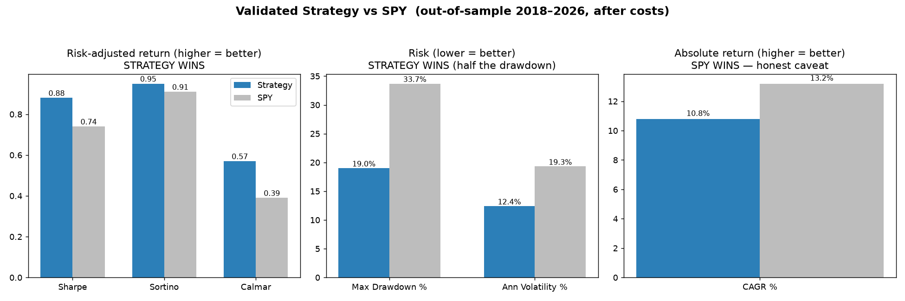

# Start Here — Autonomous Trading System (Overview & Review Packet)

> **One-page index.** This is the single place to review the project. It links to
> the original vision, the exact prompts that designed it, what's actually built,
> and what the validated backtest achieved. Share **this page's link** and a
> reviewer can reach everything from here.

---

## 1. The original vision (what was asked for)

The aspirational design target — capital-structure percentages, universe,
expected-value engine, 6 market regimes, no-trade conditions, Kelly/position
caps, risk rules, data-source weights, the learning loop, and the decision
hierarchy.

- 📄 **[ORIGINAL_GOALS.md](ORIGINAL_GOALS.md)** — readable on GitHub
- 📑 **[Original_Goals_Spec.pdf](assets/Original_Goals_Spec.pdf)** — shareable PDF

> ⚠️ This is the **original vision**, not a claim about the current build. Several
> items are aspirational, infeasible with available data, or were later found by
> testing to be counterproductive.

## 2. The original prompts (how it was designed)

The verbatim design/directive prompts that built the system — the master
directive, the GOAL / LEARN / GOVERNANCE / PAPER-GATE role prompts, the
source-and-percentage specs, and the key build decisions.

- 📑 **[Original_Prompts.pdf](assets/Original_Prompts.pdf)** — 18 substantive prompts, timestamped

## 3. What's actually built vs. not (the honest status)

- 🔎 **[GOAL_IMPLEMENTATION_AUDIT.md](GOAL_IMPLEMENTATION_AUDIT.md)** — line-by-line: implemented, partial, infeasible, or proven counterproductive.
- 📡 **[MONITORING_SPEC.md](MONITORING_SPEC.md)** — the institutional monitoring/ranking/reporting vision with a per-source/per-factor feasibility map (≈35% of the designed source diet is live today).
- 🧪 **[PAPER_TESTING.md](PAPER_TESTING.md)** — the 90–180 day forward shadow horse-race + promotion gate.
- ☁️ **[DEPLOY_DIGITALOCEAN.md](DEPLOY_DIGITALOCEAN.md)** — run it 24/7 on a droplet with n8n.

## 4. What the validated backtest achieved

The strategy is a **regime-gated low-volatility equity strategy**. It beats SPY
on a **risk-adjusted** basis (higher Sharpe/Calmar, about **half the drawdown**)
but **not** in absolute return — and we say so plainly.

| Metric | Strategy | SPY | |
|---|---|---|---|
| Sharpe | **0.88** | 0.74 | better-compensated risk |
| Calmar | **0.57** | 0.39 | |
| Max drawdown | **−19%** | −34% | half the crash |
| Annual volatility | **12.4%** | 19.3% | |
| CAGR (raw return) | 10.8% | **13.2%** | ⚠️ SPY wins — honest caveat |

Out-of-sample rank-IC **0.055**, fold **t-stat 2.04** (>2 = significant), 32
walk-forward folds, leakage-checked, cost- and Monte-Carlo-stressed.

- 📊 **[BACKTEST_SUMMARY.md](BACKTEST_SUMMARY.md)** — plain-English + technical write-up
- 📈 **[backtest_metrics.csv](backtest_metrics.csv)** — import straight into Google Sheets
- 📋 **[SYSTEM_SPEC.md](SYSTEM_SPEC.md)** — formal design specification

## 5. The code

- 🏠 **[Repository home / README](../README.md)** — architecture, quickstart, how leakage is prevented.

---

### One-line summary for a reviewer

> *We built a trustworthy, leakage-proof testing engine and used it to find a
> modest but statistically real, risk-reducing equity strategy — a lower-risk
> alternative to the S&P 500, not a way to beat it in dollars. The honest "good
> but modest" result is the achievement; eleven earlier versions that looked
> spectacular were leakage artifacts.*
